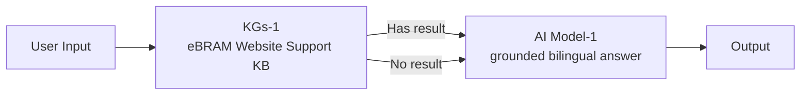

# Agent K - eBRAM Service Assistant

Agent K is the internal code for the Case 6A FlowAgent. Its public product name is `eBRAM 服务指导助手 / eBRAM Service Assistant`; user-facing messages do not expose the internal code.

## Flow (mermaid)

## Runtime policy

- Supported response languages: English and Traditional Chinese.
- Short-term memory: enabled for 10 recent rounds; each user/chat owns a separate conversation.
- Long-term memory, user properties, tools, workflows, databases and reasoning display: disabled.
- Retrieval uses Hybrid Search at `0.9` embedding rate (10% keyword, 90% semantic), threshold `0.76`, Top K `5`, query enhancement on, BGE rerank and graph recall off. These values are the first live tuning result: Q01–Q09 retain a correct source in Top 5 while Q10 returns no knowledge hit.
- Factual answers cite one or two official `ebram.org` sources.
- eBRAM-related knowledge gaps use the verified Contact Us route; unrelated questions receive a scope response without a fabricated personal preference.

## Deployment status

- Source baseline: `GPTbots_.bot/Case 6A.bot`.
- Generated artifact: `GPTbots_.bot/generated/Case6A-Agent-K.bot`.
- Published test version: `v1.0.5`.
- Active test knowledge base: `eBRAM Website Support KB (Case 6A Test) r2`, containing 28 available documents.
- The generated file is bound to the r2 knowledge-base id by `sync_case6a_kb.py`.
- Retrieval Q01–Q10, 15 individual Agent questions, multi-turn context and new-conversation isolation passed on 2026-07-23.
- The Case 6A web integration uses private server-side conversation mapping, two-hour application sessions and blocking replies through `/case6a/session/chat`.
- Test version `v1.0.2` and its 25-document knowledge base remain available as rollback artifacts.
- Only the designated GPTBots test-mode Agent may be imported/released.

## Knowledge policy

- The Sitemap is used only to discover official URLs. Selected official pages and attachments are mechanically cleaned into `Case_6A_KB/docs` and uploaded through the public Knowledge API.
- The customer questions are an acceptance set only; they are not imported as pre-written Q&A knowledge.
- News, events, careers, videos, dynamic individual rosters and unrelated research are excluded by default.
- Canonical rules, policies, fee schedules and service pages take precedence over promotional material.
- Long rules PDFs also produce three verbatim fee-schedule extracts so fee enquiries can recall the official tables without losing the complete rules documents.
