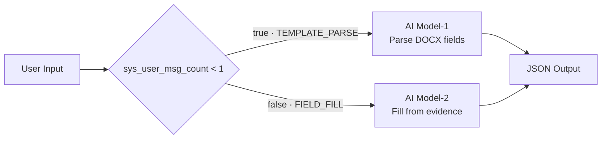

# Agent L — Service Agreement Drafting

Internal GPTBots FlowAgent for Case 6B. The original
`GPTbots_.bot/EBRAM-Case6B.bot` remains unchanged.

## Flow (mermaid)

## Runtime contract

- First message: `[CASE6B_PHASE:TEMPLATE_PARSE]`, placeholder locator manifest and one DOCX.
- Second message in the same conversation: `[CASE6B_PHASE:FIELD_FILL]`, explicit `field_list`
  and explicit `full_summary`.
- Both LLM components return one JSON object.
- Long-term memory, user properties, tools, workflows and databases are disabled.
- Short-term memory is auxiliary only; critical state is always supplied explicitly.
- Agent L never edits the DOCX. The application validates JSON and performs deterministic
  document replacement in the later integration phase.

## POC fixtures

- `fixtures/template_field_manifest.json`: 37 stable template fields.
- `fixtures/full_summary.json`: curated facts from all 9 customer materials.
- `fixtures/expected_fill.json`: expected status and values for the sample.

Run `run_case6b_poc.py` only after the generated bot is imported and released to the Case 6B
test-mode Agent. The script reads `AGENT_L_API_KEY` from the process environment or ignored
local `.env`; it never writes the key or GPTBots conversation identifiers to reports.

## Test-mode result

- Published version: `v1.0.4`
- Two-stage POC: passed on 2026-07-24
- Live route: first turn (`0 < 1`) → `AI Model-1`; second turn (`1 < 1` is false)
  → `AI Model-2`
- Evaluation history: `evaluation-v1.0.2.md`, `evaluation-v1.0.3.md`,
  `evaluation-v1.0.4.md`
