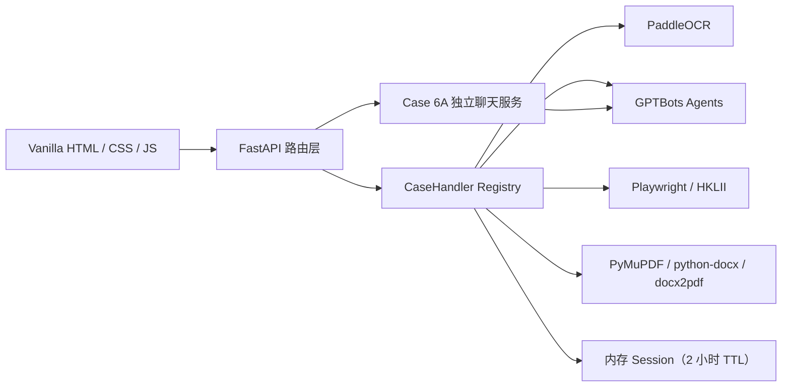

# eBRAM AI 文档助手（eBRAM3）

eBRAM3 是一个面向法律及争议解决场景的 AI 工作台。系统以 FastAPI 单体服务为核心，将 PaddleOCR、GPTBots Agents、网页检索和文档格式化组合为独立 Use Case。

当前发布候选为 `case6a-case6b-v1.0`（2026-07-25），包含 Case 1、2、4、5、6A、6B。Case 3A / 3B 尚未开发。

## 功能状态

| Use Case | 状态 | 输入与处理 | 输出 |
|---|---|---|---|
| Case 1 | 已实现 | 双方 PDF → PaddleOCR → Agent A 逐页处理 → Agent B 分方综合分析 | 甲方、乙方或通用问题清单；DOCX/PDF；支持追问 |
| Case 2 | 已实现 | 甲方/乙方/通用材料 → OCR/Agent A → 分方合并 → Agent C | 调解员简报；DOCX/PDF；支持追问 |
| Case 3A / 3B | 未实现 | 仅保留客户输入样例 | 无页面、接口或 Agent 集成 |
| Case 4 | 已实现 | 单份 PDF → PyMuPDF 拆页 → Agent I 图片翻译 → 按原页尺寸合并 | 英文与繁体中文双向译文 PDF；不支持追问 |
| Case 5 | 已实现 | 关键词 → Playwright 检索 HKLII → Agent J 摘要 | HKLII 案例摘要；DOCX/PDF；支持追问 |
| Case 6A | 已实现 | 用户问题 → Agent K + eBRAM 官网 RAG 知识库 | 双语服务指导回答与官方来源链接 |
| Case 6B | 已实现 | DOCX 模板 + 事实材料 → Agent A 摘要 → Agent L 双阶段 → 人工审阅 | 服务协议草案；DOCX/PDF；不支持追问 |

## 系统架构



- 前端没有构建步骤，使用 `fetch`、SSE、marked 和 DOMPurify。
- Case 1、2、4、5、6B 通过 `CaseHandler` 与 Registry 统一分析、下载和追问契约。
- Case 6A 是纯文本 RAG 聊天，使用独立会话路由，不进入 PDF Handler。
- 浏览器使用 `localStorage` 保存会话标题和界面历史；客户文件正文与 GPTBots conversation ID 不写入本地历史。

## 快速开始

### 1. 获取私有仓库

仓库协作者先在 GitHub 完成授权：

```powershell
git clone https://github.com/NeveruaryLi/eBRAM3---OCR--.git
cd eBRAM3---OCR--
```

真实凭证通过密码管理器或受控渠道提供，不在 GitHub、Issue 或 PR 中发送。

### 2. 安装运行环境

项目以 Python 3.11 为基线：

```powershell
conda create -n ebram python=3.11
conda activate ebram
pip install -r requirements.txt
playwright install chromium
```

Case 5 需要 Chromium。Case 6B 的 PDF 转换优先使用 LibreOffice headless；未安装时回退到 `docx2pdf`，Windows 上需要 Microsoft Word。

### 3. 配置环境变量

```powershell
Copy-Item .env.example .env
```

| 变量 | 用途 | 缺失影响 |
|---|---|---|
| `api_key` | Agent A：Case 1/2/6B 材料处理 | 阻止服务启动 |
| `AGENT_B_API_KEY` | Agent B：Case 1 综合分析 | 阻止服务启动 |
| `PADDLE_OCR_TOKEN` | Case 1/2/6B OCR | 阻止服务启动 |
| `AGENT_C_API_KEY` | Agent C：Case 2 调解员简报 | 仅 Case 2 不可用 |
| `AGENT_I_API_KEY` | Agent I：Case 4 页面翻译 | 仅 Case 4 不可用 |
| `AGENT_J_API_KEY` | Agent J：Case 5 案例摘要 | 仅 Case 5 不可用 |
| `AGENT_K_API_KEY` | Agent K：Case 6A 服务指导 | 仅 Case 6A 不可用 |
| `AGENT_L_API_KEY` | Agent L：Case 6B 协议草案 | 仅 Case 6B 不可用 |

GPTBots 默认使用新加坡区域端点。不要提交 `.env`。

### 4. 启动

```powershell
uvicorn app:app --reload --port 8000
```

打开 <http://localhost:8000>。

## 各 Case 处理逻辑

### Case 1：当事人谈判问题生成

上传的 PDF 按甲方、乙方或通用材料分类。PaddleOCR 输出逐页 Markdown，Agent A 对每页提取结构化内容；Handler 将通用材料分别并入双方上下文，再由 Agent B 为各方生成谈判准备问题。单方失败不会删除另一方已成功的结果。

### Case 2：调解员简报

材料同样按甲方、乙方和通用标记。OCR 与 Agent A 完成逐份处理后，应用按 party 合并为三份 Markdown 附件，由 Agent C 生成一份调解员简报。

### Case 4：PDF 图片翻译

Case 4 不使用 OCR。单份 PDF 以 150 DPI 转为 RGB PNG，页面超过 9.5 MB 时依次降到 120、96 DPI。一个 PDF 共用一个 Agent I conversation，并按页串行发送。系统优先下载 GPTBots 原始译图，必要时回退缩略图，再按原始页面尺寸、顺序和比例合并为 PDF。

限制：25 MB、30 页、单页最长 300 秒、最多三次可重试请求。任一页面最终失败时不生成部分译文。

### Case 5：HKLII 案例检索

用户输入关键词后，Playwright 搜索并抓取最多 10 条 HKLII 案例正文。应用将结果整理成 Markdown 附件交给 Agent J，生成案例摘要并保留后续追问上下文。

### Case 6A：eBRAM 服务指导助手

Case 6A 的用户侧名称为“eBRAM 服务指导助手 / eBRAM Service Assistant”，内部 Agent 代号为 Agent K。知识库包含 28 份从 eBRAM 官方页面和附件清洗得到的文档，回答支持英文和繁体中文，并引用官方来源。

浏览器只持有应用 Session ID；服务端维护其与 GPTBots conversation 的映射。发送采用 blocking 模式，正文缺失时只查询 `/v2/messages` 获取本轮新增 Assistant 回复，不重复发送用户问题。Session 有效期两小时，每条问题最长 4000 字符。

知识库构建和同步说明见 [Case_6A_KB/README.md](Case_6A_KB/README.md) 与 [Agent K overview](GPTbots_.bot/generated/case6a/overview.md)。

### Case 6B：服务协议草案生成

用户上传一份 DOCX 模板和 1–20 份事实材料：

- PDF、PNG、JPG、JPEG、JFIF 经过 PaddleOCR。
- XLSX、DOCX、CSV 在本地提取为带页码、工作表或单元格位置的 Markdown。
- 每份材料使用独立 Agent A conversation，避免不同来源互相污染。
- 模板扫描器识别跨 Word Run 的连续下划线和 `[Field_Name]` 方括号占位符，并生成稳定 `field_id` 与 locator。

Agent L 在同一 conversation 内执行两轮：

1. 文本说明 + 原始 DOCX + `case6b_template_context.md`，解析全部字段语义。
2. 文本说明 + `case6b_field_fill_context.md`，根据字段清单、材料事实和冲突输出填充结果。

关键数据全部放在 Markdown 附件中，不依赖短期记忆。用户可审阅字段、证据、冲突和重复服务行；未解决冲突阻止生成，签名和签署日期保持空白。最终在原模板副本中精准替换占位符，分别生成 DOCX 和 PDF。

详细限制和审阅契约见 [项目交接文档](docs/HANDOVER.md) 与 [Agent L overview](GPTbots_.bot/generated/case6b/overview.md)。

## 主要接口

| 方法 | 路径 | 用途 |
|---|---|---|
| GET | `/`、`/case1`、`/case2`、`/case4`、`/case5`、`/case6a`、`/case6b` | 页面入口 |
| POST | `/pdf/pages/chat` | Case 1/2 上传、OCR、Agent A 处理 |
| POST | `/pdf/session/analyze` | Case 1/2/4/5/6B SSE 分析 |
| POST | `/pdf/session/report` | 下载已完成的 DOCX/PDF |
| POST | `/pdf/session/chat` | Case 1/2/5 结果追问 |
| DELETE | `/pdf/session/{session_id}` | 重置 Case 1/2/5/6B 应用 Session |
| POST | `/case4/session/upload` | Case 4 PDF 和翻译方向 |
| POST | `/case5/scrape` | Case 5 HKLII 搜索与抓取 |
| POST | `/case6a/session`、`/case6a/session/chat` | Case 6A 会话与问答 |
| DELETE | `/case6a/session/{session_id}` | 删除 Case 6A 应用 Session |
| POST | `/case6b/session/upload` | Case 6B 模板与材料上传 |
| GET | `/case6b/session/{id}/template` | 模板自动预检结果 |
| POST | `/case6b/session/{id}/retry` | 仅重试失败材料 |
| GET/PATCH | `/case6b/session/{id}/review` | 读取或更新字段审阅 |
| POST | `/case6b/session/{id}/finalize` | 确认风险并生成草案 |

## 项目结构

```text
api/            FastAPI 路由、SSE 和应用会话服务
cases/          CaseHandler 基类、Registry 与 Case 1/2/4/5/6B
model/          配置、GPTBots/PDF 公共工具和数据模型
scraper/        Case 5 HKLII Playwright 抓取
static/         首页及各 Case 的 HTML/CSS/JavaScript
Case_6A_KB/     Case 6A 官网知识清洗、28 份 Markdown 与来源清单
GPTbots_.bot/   Agent I/K/L 原始配置、生成脚本、Prompt 和评估记录
tests/          后端、Agent 构建、前端契约与会话测试
tools/          Case 6B 客户样例和前端 smoke 工具
docs/           项目交接文档
```

## 测试

```powershell
conda run -n ebram python -m unittest discover -s tests -v
node --check static\case1.js
node --check static\case2.js
node --check static\case4.js
node --check static\case5.js
node --check static\case6a.js
node --check static\case6b.js
```

本发布基线包含 99 项 Python 测试。外部 GPTBots、PaddleOCR、HKLII、LibreOffice 和 Word 仍需在目标环境进行集成验证。

## 已知限制与安全

- Session、上传材料和结果保存在进程内存中，默认两小时 TTL；服务重启后不可恢复，不支持多实例共享。
- Case 5 的 `ScrapedResult` 没有 `created_at`，现有自动清理会跳过其 Session；手动重置/删除仍可清理。
- Case 6B 仅支持常规 DOCX 占位符，不支持内容控件、邮件合并域、文本框和复杂浮动 Word 对象。
- Case 6B 的 PDF 转换依赖本机 LibreOffice 或 Microsoft Word；两者均失败时仍保留 DOCX 下载。
- Agent 和模型输出具有不确定性，费用、规则、译文和协议内容必须由业务人员复核。
- 仓库当前为 Private，但旧公开 Git 历史曾包含真实 Agent A、Agent B 和 PaddleOCR 凭证，且尚未完成轮换；私有化不能使旧凭证自动失效。
- 不得提交 `.env`、API Key、日志、缓存、客户输出或运行时会话数据。

完整架构、数据契约和后续开发规则见 [docs/HANDOVER.md](docs/HANDOVER.md)。
