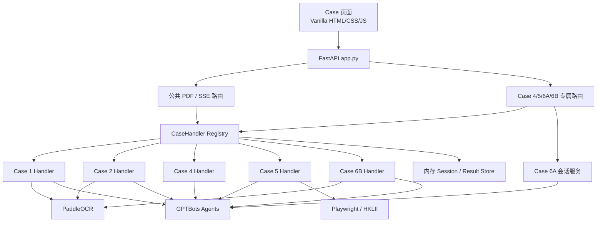

# eBRAM AI 文档助手 — 项目交接文档

> 发布基线：`case6a-case6b-v1.0`；更新日期：2026-07-25；已实现：Case 1、2、4、5、6A、6B；未实现：Case 3A / 3B。

本文以实际代码为第一事实来源，记录当前系统架构、各 Use Case 的完整数据流、GPTBots Agent 分工、接口、会话状态、限制和后续开发约束。

## 1. 项目定位

eBRAM3 将三类能力组合成法律科技工作台：

1. **识别与采集**：PaddleOCR 处理 PDF/图片，Playwright 检索 HKLII，本地解析 DOCX/XLSX/CSV。
2. **AI Agent**：通过 GPTBots Agent API 创建 conversation、发送消息、查询 `/v2/messages` 并取得文本或图片结果。
3. **格式化与交付**：将 OCR/Agent 输入整理为 Markdown 或附件，将输出转换为 Markdown、DOCX 或 PDF。

后端是 Python 3.11 + FastAPI 单体服务；前端是原生 HTML/CSS/JavaScript，没有打包或构建流程。Case 业务通过 Handler 插件化，Case 6A 作为纯文本 RAG 聊天使用独立路由。

## 2. 启动与配置

```powershell
git clone https://github.com/NeveruaryLi/eBRAM3---OCR--.git
cd eBRAM3---OCR--

conda create -n ebram python=3.11
conda activate ebram
pip install -r requirements.txt
playwright install chromium

Copy-Item .env.example .env
uvicorn app:app --reload --port 8000
```

### 2.1 环境变量

| 变量 | Agent / 服务 | Case | 缺失行为 |
|---|---|---|---|
| `api_key` | Agent A | 1、2、6B | 启动失败 |
| `AGENT_B_API_KEY` | Agent B | 1 | 启动失败 |
| `PADDLE_OCR_TOKEN` | PaddleOCR | 1、2、6B | 启动失败 |
| `AGENT_C_API_KEY` | Agent C | 2 | 仅 Case 2 调用失败 |
| `AGENT_I_API_KEY` | Agent I | 4 | 仅 Case 4 不可用 |
| `AGENT_J_API_KEY` | Agent J | 5 | 仅 Case 5 调用失败 |
| `AGENT_K_API_KEY` | Agent K | 6A | 仅 Case 6A 不可用 |
| `AGENT_L_API_KEY` | Agent L | 6B | 仅 Case 6B 不可用 |
| `base_url` | GPTBots 发送消息 | 全部 Agent | 默认新加坡节点 |
| `create_conversation_url` | GPTBots 创建会话 | 全部 Agent | 默认新加坡节点 |
| `messages_url` | GPTBots 会话消息详情 | 4、6A、6B 等 | 默认新加坡节点 |

真实密钥只能写入本地 `.env` 或部署 Secret。不要将密钥写入代码、`.bot`、日志、Issue 或 PR。

### 2.2 本地依赖

- Case 5：安装 Playwright 后还需执行 `playwright install chromium`。
- Case 1/2/5：DOCX 由 `python-docx` 生成，PDF 通过 `docx2pdf` 转换，Windows 需要 Microsoft Word。
- Case 4：PyMuPDF 直接组装 PDF，不依赖 Word。
- Case 6B：优先使用 LibreOffice headless 将 DOCX 转 PDF，失败后回退 Word/docx2pdf；两者都失败时只提供 DOCX。
- Case 6A 知识清洗使用 PyMuPDF 和 lxml。

## 3. 总体架构



### 3.1 目录

```text
app.py
api/
  pdf_chat.py             公共上传、分析、报告、追问和 Session 删除
  case4_routes.py         Case 4 单 PDF 上传
  case5_routes.py         Case 5 HKLII 搜索与抓取 SSE
  case6a_routes.py        Case 6A 私有会话映射和文本问答
  case6b_routes.py        Case 6B 上传、重试、中断、Word 文档视图、审阅和 finalize
cases/
  base.py                 CaseHandler + SseEvent 契约
  __init__.py             Registry / Factory
  case1_*.py              Case 1
  case2_*.py              Case 2
  case4_*.py              Case 4
  case5_*.py              Case 5
  case6b_*.py             Case 6B
model/                    配置、数据模型和 GPTBots/PDF 公共工具
scraper/                  HKLII Playwright 抓取
static/                   首页及 Case 1/2/4/5/6A/6B 页面
Case_6A_KB/               官网知识库构建源码与 28 份 Markdown
GPTbots_.bot/             Agent I/K/L 原始配置、生成文件、Prompt、评估
tests/                    99 项自动化测试
tools/                    Case 6B E2E / smoke 工具
input_example/            客户样例
```

### 3.2 Handler Registry

当前 Registry：

```python
REGISTRY = {
    "case1": Case1Handler,
    "case2": Case2MediatorBriefingHandler,
    "case4": Case4PdfTranslationHandler,
    "case5": Case5HkliiSearchHandler,
    "case6b": Case6BDraftingHandler,
}
```

每个 Handler 实现：

- `analyze()`
- `generate_report()`
- `followup_chat()`
- `get_downloadable_keys()`

Case 6A 不处理文件或报告，因此不加入 Registry。

### 3.3 SSE 契约

`POST /pdf/session/analyze` 使用 SSE：

- 路由事件：`analyze_start`、`analyze_complete`、`fatal_error`
- Handler 事件：`progress`、`result`、`error`

`result.result_key` 必须与 `get_downloadable_keys()` 一致，且结果必须先写入 `session_results_store`，再发送 `result`。

各 Case result key：

| Case | result key |
|---|---|
| 1 | `甲方`、`乙方` 或 `通用` |
| 2 | `调解员简报` |
| 4 | `译文PDF` |
| 5 | `HKLII 案例摘要` |
| 6B | `协议草案` |

### 3.4 Session

公共状态使用进程内字典：

- `session_store`：上传材料、OCR 结果或 Case 专属对象。
- `session_results_store`：分析文本、Agent conversation 和生成文件。
- `session_metadata`：`case_type`、方向、关键词等。
- Case 6A/6B 另有专属 Session 对象与并发锁。

默认 TTL 为两小时。应用重启会清空全部状态，不支持数据库持久化、多实例共享或恢复。

## 4. Agent 与外部能力

| 代号 | 环境变量 | 职责 |
|---|---|---|
| Agent A | `api_key` | Case 1/2 OCR 后逐页处理；Case 6B 每份材料结构化摘要 |
| Agent B | `AGENT_B_API_KEY` | Case 1 分方综合分析和问题清单 |
| Agent C | `AGENT_C_API_KEY` | Case 2 调解员简报 |
| Agent I | `AGENT_I_API_KEY` | Case 4 页面图片双向翻译 |
| Agent J | `AGENT_J_API_KEY` | Case 5 HKLII 案例摘要 |
| Agent K | `AGENT_K_API_KEY` | Case 6A eBRAM 官网 RAG 服务指导 |
| Agent L | `AGENT_L_API_KEY` | Case 6B 模板字段解析和事实填充 |

GPTBots 发送消息使用 `messages[].content[]`。文档附件使用：

```json
{
  "type": "document",
  "document": [{
    "base64_content": "...",
    "format": "md",
    "name": "source.md"
  }]
}
```

图片附件使用 `type=image` 和 `image:[item]`。Agent 调用默认 `response_mode=blocking`；当投递结果不确定时先查询 `/v2/messages`，避免重复发送。

## 5. 各 Case 完整逻辑

### 5.1 Case 1 — 当事人谈判问题生成

**页面**：`/case1`

**输入**：一份或多份 PDF，每份标记甲方、乙方或通用。

**Agent**：A、B。

```text
PDF
→ PaddleOCR
→ Agent A 逐页处理
→ 按 party 暂存
→ 通用材料分别并入甲乙方
→ Agent B 为每方建立独立 conversation
→ 问题清单
→ DOCX/PDF/追问
```

处理特点：

- 甲方和乙方串行综合分析，conversation 相互隔离。
- 如果只有通用材料，产出 `result_key="通用"`。
- 单方 Agent B 失败时，另一方成功结果仍可下载。
- Agent B 对 429、超时和 5xx 进行有限重试；用户错误不暴露平台 URL。
- 首次追问会建立对话并注入分析结果，之后复用 conversation。

### 5.2 Case 2 — 调解员简报

**页面**：`/case2`

**输入**：一份或多份 PDF，每份标记甲方、乙方或通用。

**Agent**：A、C。

```text
PDF
→ PaddleOCR
→ Agent A 逐页处理
→ 按 CLAIMANT / RESPONDENT / COMMON 合并 Markdown
→ Agent C
→ 调解员简报
→ DOCX/PDF/追问
```

Case 2 固定产生一份 `调解员简报`。追问使用 Agent C，并在新 conversation 中注入简报上下文。

### 5.3 Case 3A / 3B

当前只有 `input_example/Usecase 3A and 3B` 客户样例。没有：

- 首页卡片和独立页面
- FastAPI 路由
- CaseHandler
- Agent 配置或 API Key
- 自动化测试

后续开发不得把样例存在误写为功能已实现。

### 5.4 Case 4 — PDF 图片翻译

**页面**：`/case4`

**上传**：`POST /case4/session/upload`

**Agent**：I。

**输入**：一份 PDF，方向为 `en_to_zh_tw` 或 `zh_tw_to_en`。

```text
PDF 校验
→ PyMuPDF 读取原页尺寸
→ 150 DPI RGB PNG
→ 过大时降到 120 / 96 DPI
→ 同一 Agent I conversation 串行逐页翻译
→ blocking 响应或 /v2/messages 取得图片
→ 优先原图 URL，失败时缩略图
→ 校验并按原页尺寸居中铺放
→ 译文 PDF
```

约束：

- PDF 最大 25 MB、30 页。
- 单页发送图片最大 9.5 MB，Agent 输出图片最大 20 MB。
- 每页最长 300 秒；429、超时、5xx 最多三次尝试。
- 400、401、403 不重试。
- 任一页最终失败则整份失败。
- 不使用 PaddleOCR，不支持 DOCX，不支持追问。
- 页面没有聊天历史。

Agent I 生成配置和 Prompt 位于 `GPTbots_.bot/generated/`。测试模式记录为 `v1.0.3`。

### 5.5 Case 5 — HKLII 案例检索

**页面**：`/case5`

**入口**：`POST /case5/scrape`

**Agent**：J。

```text
关键词
→ Playwright 搜索 HKLII
→ 最多 10 条结果
→ 并发抓取案例正文
→ 整理为 Markdown 附件
→ Agent J
→ HKLII 案例摘要
→ DOCX/PDF/追问
```

正文单条超过安全字符限制时截断。搜索无结果会发送 `no_results`，爬取过程使用专属 SSE 进度事件。

已知问题：`ScrapedResult` 没有 `created_at`，后台 TTL 扫描会跳过 Case 5；用户重置或删除会话仍会调用公共 Session 删除接口。

### 5.6 Case 6A — eBRAM 服务指导助手

**页面**：`/case6a`

**用户名称**：eBRAM 服务指导助手 / eBRAM Service Assistant

**内部 Agent**：K。

知识库：

- 测试知识库：`eBRAM Website Support KB (Case 6A Test) r2`
- 28 份可用文档
- 来源仅限 eBRAM 官网页面或官方附件
- 新闻、活动、招聘、视频、动态个人名册和无关研究默认排除
- Hybrid Search、Top K 5、阈值 0.76、query enhancement 和 rerank 开启
- 测试模式 Agent K：`v1.0.5`

```text
新建应用 Session
→ 服务端创建 GPTBots conversation
→ 浏览器只接收随机 Session ID
→ 用户发送纯文本问题
→ Agent K 检索官网知识
→ blocking 返回
→ 若无正文，轮询 /v2/messages 的本轮新增 Assistant 消息
→ 返回 Markdown 回答
```

规则：

- 每条消息 1–4000 字符。
- Session 两小时 TTL。
- 同一 Session 复用 conversation；不同 Session 相互隔离。
- 同一 Session 使用独立锁，并发发送返回 `SESSION_BUSY`。
- short-term memory 开启，long-term memory 关闭。
- 回答支持英文和繁体中文，提供一至两个官方来源。
- 官网无充分资料时提供经核验的 Contact Us 引导；离题问题不编造。
- 不提供附件、报告、OCR 或法律意见。
- `/v2/messages` 回退只查询，不重新发送问题；异常投递会污染当前 Session 并要求开启新对话。

知识库源码：

- `Case_6A_KB/build_case6a_kb.py`：受控抓取和清洗。
- `Case_6A_KB/docs/`：28 份上传 Markdown。
- `Case_6A_KB/source_manifest.csv`：来源与内容哈希。
- `GPTbots_.bot/generated/case6a/sync_case6a_kb.py`：Knowledge API 同步、向量状态和检索验收。
- `.cache`、`upload-state.json`、远端 ID 和原始评估响应不提交。

### 5.7 Case 6B — 服务协议草案生成

**页面**：`/case6b`

**Handler**：`Case6BDraftingHandler`

**Agent**：A、L。

**Agent L 测试模式**：`v1.0.9`。

#### 上传

- 模板：仅 DOCX，最大 10 MB。
- 材料：1–20 份。
- 支持 PDF、PNG、JPG、JPEG、JFIF、XLSX、DOCX、CSV。
- PDF/图片最大 25 MB；XLSX/DOCX/CSV 实际按 10 MB 限制。
- 总上传最大 100 MB。
- 单个 PDF 最多 30 页。
- PDF 页与图片合计最多 60 个 OCR 单元。
- XLSX 最多 20 个可见工作表和 10,000 个有效单元格。
- 不接受 PDF 模板，不接受可选表单 JSON。

浏览器待上传阶段可移除、更换模板，也可追加或删除材料；点击开始分析后文件列表锁定。需要换文件时必须重置当前任务。

#### 模板扫描

应用本地确定性扫描：

- 连续下划线，包括跨 Word Run 的占位符。
- `[Provider_Name]`、`[Effective Date]` 等方括号占位符。
- 正文和表格位置。
- 表头、前后文、重复行和签署区候选。
- 为每个实际位置生成稳定 `field_id` 和回填 locator。

同名占位符多次出现时保留不同位置。模板没有可识别占位符，或包含内容控件、文本框、邮件合并域、复杂浮动对象等无法稳定回填的结构时拒绝处理。

模板预检是自动、只读诊断，不使用客户专属模板档案，也不要求用户选择 profile。

#### 材料处理

```text
PDF → PaddleOCR
PNG/JPG/JFIF → 无损封装单页 PDF → PaddleOCR
XLSX → openpyxl 提取工作表、单元格和公式文本
DOCX → 本地提取段落与表格
CSV → 本地提取行列
→ 每份材料独立 Agent A conversation
→ 结构化事实、原始值、规范化值和证据位置
→ 按文件顺序组装 full_summary
```

任何材料失败都会阻止 Agent L 草案阶段，但成功材料结果保留。`POST /case6b/session/{id}/retry` 只处理指定失败材料。

#### Agent L 两阶段契约

FlowAgent 路由条件为 `sys_user_msg_count < 1`。GPTBots 在处理当前消息前计算该值：

- 第一轮计数 0，进入模板解析模型。
- 第二轮计数 1，进入字段填充模型。

第一轮发送：

1. 一段短文本，说明两个附件分别是什么、要求读取全部字段并只返回 JSON。
2. 原始 DOCX 模板。
3. `case6b_template_context.md`，包含阶段标记、字段、locator、上下文、重复区块和 JSON 契约。

第二轮发送：

1. 一段短文本，说明附件包含第一轮字段清单与材料证据，并要求只返回填充 JSON。
2. `case6b_field_fill_context.md`，包含阶段标记、完整 `field_list`、`full_summary`、冲突、原始值和规范化值。

关键数据完全包含在 Markdown 附件中。短期记忆只辅助上下文，不作为唯一状态来源。

Agent L 必须：

- 第一轮返回全部已检测 `field_id`，不得新增、删除或修改 locator。
- 第二轮为每个字段恰好返回一次结果。
- 只使用 `FILLED`、`NEEDS_CONFIRMATION`、`REMOVE`、`LEAVE_BLANK`、`KEEP_BLANK`。
- 填充值必须带证据。
- 缺失或冲突不得推测。
- 重复服务行使用 `included`、`optional`、`blank`、`remove`。
- 个人姓名、签名和签署日期保持空白；签署方公司名称可填写。

如果发送超时或 5xx，应用先查询会话消息确认是否已生成回复。无法确认阶段结果时创建新 conversation，并按第一、第二轮顺序重放，避免计数路由错位。

#### 审阅和生成

分析完成后返回 `result_key="协议草案"`，但 finalize 前不可下载。

- Review 带版本号，PATCH 旧版本返回冲突，防止覆盖新状态。
- 用户可修改所有非签名字段，也可通过 `accepted_field_ids` 在不改变文本时接受 Agent 建议。
- 人工修改或接受建议标记为 `USER_CONFIRMED`，保留 Agent 原值和审计信息。
- 未解决事实冲突阻止 finalize。
- 普通 `NEEDS_CONFIRMATION` 字段允许在二次确认风险后生成，并用黄色 `[TO BE CONFIRMED]` 或 `[待確認]` 标记。
- 服务名称与价格必须成对保留、留空或删除。
- 修改 Review 后旧生成文件立即失效。
- 后端生成带唯一字段标记的只读 DOCX shell；浏览器通过本地固定版本 `docx-preview` 与 JSZip 渲染近似 Word 页面，并只把识别出的标记替换为输入控件。
- “预填草案 / 查看原模板”在同一文档位置切换；差异高亮、待补导航和证据抽屉不改变最终 DOCX。
- 字段停止输入约 800 毫秒或失焦后自动串行 PATCH；保存失败保留浏览器值，版本冲突暂停自动保存。
- 处理中可按 `analysis_run_id` 幂等取消；取消后迟到的 OCR/Agent 结果不得写回，浏览器保留已选择文件供删除、更换并完整重跑。

文档生成在原模板内存副本上按 locator 替换，不重建整个模板。浏览器里的 HTML/输入控件不参与 DOCX 反向生成。未使用服务行从 OOXML 完整删除；固定条款、字体、表格、页边距、页眉页脚和签署区尽量保留。

输出：

- `原模板名_服务协议草案.docx`
- `原模板名_服务协议草案.pdf`

Case 6B 不支持结果追问。

## 6. 接口

### 页面

| 方法 | 路径 |
|---|---|
| GET | `/` |
| GET | `/case1` |
| GET | `/case2` |
| GET | `/case4` |
| GET | `/case5` |
| GET | `/case6a` |
| GET | `/case6b` |

### 公共 PDF / Handler

| 方法 | 路径 | 用途 |
|---|---|---|
| POST | `/pdf/pages/chat` | Case 1/2 上传、OCR、Agent A |
| POST | `/pdf/session/analyze` | Case 1/2/4/5/6B SSE 分析 |
| POST | `/pdf/session/report` | DOCX/PDF 下载 |
| POST | `/pdf/session/chat` | Case 1/2/5 追问 |
| DELETE | `/pdf/session/{session_id}` | 幂等删除公共 Session |

`/pdf/chat`、`/conversation`、`/chat` 和 `/graph/chat` 是旧兼容接口，不应作为新增 Case 的首选入口。

### Case 4 / 5

| 方法 | 路径 |
|---|---|
| POST | `/case4/session/upload` |
| POST | `/case5/scrape` |

### Case 6A

| 方法 | 路径 |
|---|---|
| POST | `/case6a/session` |
| POST | `/case6a/session/chat` |
| DELETE | `/case6a/session/{session_id}` |

### Case 6B

| 方法 | 路径 |
|---|---|
| POST | `/case6b/session/upload` |
| GET | `/case6b/session/{session_id}/template` |
| POST | `/case6b/session/{session_id}/retry` |
| GET | `/case6b/session/{session_id}/review` |
| PATCH | `/case6b/session/{session_id}/review` |
| POST | `/case6b/session/{session_id}/cancel` |
| GET | `/case6b/session/{session_id}/document-view` |
| GET | `/case6b/session/{session_id}/document-shell?manifest_hash={hash}` |
| POST | `/case6b/session/{session_id}/finalize` |
| DELETE | `/case6b/session/{session_id}` |

## 7. 前端与交互

设计基线：

- 248px 左侧导航、Outfit 字体、深浅主题、克制的法律科技视觉。
- Case 4 使用低饱和铜金色。
- Case 6A 使用低饱和青绿色。
- Case 6B 使用低饱和靛青色。
- 桌面端和 390px 移动端布局。
- 支持 `prefers-reduced-motion`、键盘焦点和 `aria-live`。

历史：

- Case 1：`ebram_history`
- Case 2：`ebram_c2_history`
- Case 5：`ebram_c5_history`
- Case 6A：`ebram_c6a_history`
- Case 6B：`ebram_c6b_history`
- Case 4 无历史。

Case 1、2、5、6A、6B 使用统一三点菜单删除当前或历史会话，并提供“重置当前对话/任务”。删除服务端 Session 失败时，本地历史仍删除，服务器状态等待 TTL 清理。

安全渲染：

- 用户文本使用 `textContent`。
- Agent Markdown 应经过 DOMPurify 清洗。
- Case 6A 来源链接只允许 HTTPS 的 `ebram.org` 及其子域，并添加 `noopener noreferrer`。

## 8. 测试和验收状态

命令：

```powershell
conda run -n ebram python -m unittest discover -s tests -v
node --check static\case1.js
node --check static\case2.js
node --check static\case4.js
node --check static\case5.js
node --check static\case6a.js
node --check static\case6b.js
```

当前自动化基线为 99 项 Python 测试，覆盖：

- Case 1 Agent B 重试和错误脱敏。
- Case 4 Agent 配置、PDF 校验、图片解析、DPI 降级和 PDF 合并。
- Case 6A Agent 身份、Session、blocking/messages 回退、会话隔离和前端安全。
- Case 6A 官网知识清洗和问题覆盖。
- Case 6B 模板、材料、Agent L 两阶段、审阅、冲突、DOCX 回填、PDF 降级和前端。
- Case 1/2/5/6A/6B 会话重置和删除。

外部验收记录：

- Agent K 测试模式 `v1.0.5`：2026-07-23 完成问题集、多轮、繁体中文和隔离验收。
- Agent L 测试模式 `v1.0.9`：2026-07-24 完成 37/37 模板字段和 37/37 填充结果双阶段 POC。

这些记录不等同于生产 SLA。PaddleOCR、GPTBots、HKLII、LibreOffice 和 Word 都是外部或本机依赖。

## 9. 已知限制与技术债务

1. **凭证风险**：仓库已改为 Private，但旧公开 Git 历史曾包含真实 Agent A、Agent B 和 PaddleOCR 凭证，且尚未轮换。
2. **内存 Session**：服务重启丢失数据，不支持数据库、多实例共享、用户鉴权或持久化恢复。
3. **Case 5 TTL**：`ScrapedResult` 缺少 `created_at`，自动清理会跳过 Case 5。
4. **Case 3**：Case 3A/3B 未实现。
5. **外部稳定性**：GPTBots、PaddleOCR、HKLII 页面结构或临时资源 URL 变化会影响结果。
6. **报告转换**：DOCX 转 PDF 依赖 LibreOffice 或 Microsoft Word。
7. **Case 4 模型质量**：译图可能出现字体、布局或识别偏差，必须人工复核。
8. **Case 6A 内容时效**：知识库是官网快照，需定期按 Sitemap 和来源清单增量更新。
9. **Case 6B Word 范围**：仅支持普通段落和表格中的下划线/方括号占位符，不支持复杂 Word 对象。
10. **自动化范围**：现有测试以契约和单元测试为主，尚缺统一 CI、覆盖率阈值和全站视觉回归。

## 10. 后续开发规则

- 新文件处理 Case 优先新增 Handler 并注册唯一 `case_type`。
- 只有输入链完全不同才新增 Case 专属上传入口。
- 不修改已锁定 Case 行为，除非有明确需求或公共缺陷。
- Agent Prompt、`.bot` 和知识库源文件使用生成脚本维护，不直接手改生成 JSON。
- Agent 关键输入使用结构化 Markdown/附件，避免仅依赖 conversation memory。
- 结果先落 Session，再发送 SSE `result`。
- 新页面复用全局设计令牌、主题、历史菜单、重置和错误语言。
- 不提交 `.env`、真实密钥、日志、缓存、客户输出、GPTBots conversation ID 或运行时上传状态。
- 发布采用 feature 分支 → 测试 → PR → merge commit → tag，不直接在 `main` 开发。
